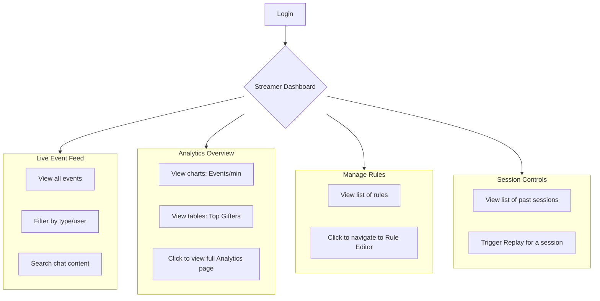

# UI/UX Flows — TikTok LIVE Platform

**Owner Agent**: Gemini (AI Agent)
**Depends on**: [docs/architecture.md](architecture.md), [docs/contracts/unified-event.v1.schema.json](contracts/unified-event.v1.schema.json)
**GitHub Issue**: [#5](https://github.com/rainbowkillah/tiktok-live-platform/issues/5)
**Status**: Approved

---

## Decision Log

- **D-UI-001: Virtualized Lists for Event Feeds**: Decided to mandate the use of virtualized lists (e.g., `react-window` or `tanstack-virtual`) for all event feeds. This is a non-negotiable requirement to meet the "handle high event volume gracefully" objective (Risk R-04).
- **D-UI-002: Two-Column Layout for Moderator View**: The moderator view will use a persistent two-column layout. The left column will be the live event feed, and the right column will display contextual details (user info, notes, actions) for a selected user or event. This prevents context switching and allows for rapid moderation.
- **D-UI-003: Distinct Views for Streamer vs. Moderator**: The Streamer and Moderator experiences will be separate, routed views (e.g., `/dashboard` and `/moderation`). They have different primary goals (overview vs. action) and should not be combined into a single complex interface.
- **D-UI-004: Command Palette for Quick Actions**: A global command palette (e.g., triggered by `Ctrl+K`) will be implemented to allow power users (especially moderators) to quickly jump to users, trigger actions, or change filters without using the mouse.
- **D-UI-005: SSE for Live Events**: The primary mechanism for receiving live events in the UI will be Server-Sent Events (SSE) from the `/streams/:streamId/events` endpoint defined in `architecture.md`. WebSockets will be used for bidirectional communication if needed (e.g., for moderation actions).

---

## Open Questions

1. **Moderator Permissions (RBAC)**: What is the precise permission model for moderators? Can they create/edit rules, or only view/test them? Can they see the analytics dashboard? This directly impacts which UI components are visible or disabled for the moderator role. (Related to Threat E-01).
2. **Mobile/Responsive Strategy**: Is a full-featured mobile experience a requirement for Phase 2, or is a desktop-first approach sufficient? The high-density views (especially for moderation) may be challenging on small screens.
3. **"Quick-Actions" Definition**: What are the specific quick-actions a moderator needs for a user? (e.g., "View user chat history", "Add private note", "Copy User ID", "Timeout user (via webhook)", "Ban user (via webhook)"). This needs to be defined in collaboration with Codex to ensure API support.
4. **Analytics Visualization Performance**: How should the analytics dashboard handle potentially millions of events for a long stream? Should we rely on pre-computed aggregates from the `stream_aggregates` table (Phase 4), or will the API provide on-the-fly aggregation?
5. **Theming and Customization**: Should the UI support theming (light/dark mode) or custom layouts? For Phase 2, this is out of scope, but it's a consideration for the future.

---

## Validation Checklist

Reviewers should verify:
- [ ] The document defines distinct flows for both the Streamer and Moderator roles.
- [ ] The proposed UI components directly map to the features described in the project mission (live feed, filters, search, rule editor, analytics, replay).
- [ ] The design explicitly addresses the "high event volume" challenge (e.g., via virtualized lists, debounced search).
- [ ] The flows for rule creation and management are logical and account for placeholders and conditions.
- [ ] The interaction between the live feed and contextual views (e.g., moderator's user detail panel) is clearly described.
- [ ] The proposed flows are feasible given the API endpoints planned in `architecture.md`.

---

## 1. Core Concepts & Information Architecture

The Web UI is a single-page application (SPA) built with a modern framework like React. It connects to the `api` service for data.

### 1.1. Key UI Components

- **Event Feed**: The core of the application. A vertically scrolling list of incoming `UnifiedEvent` items. Must be virtualized. Each event type (`CHAT`, `GIFT`, `FOLLOW`, etc.) will have a distinct visual representation.
- **Filter & Search Bar**: Sits above the Event Feed. Allows filtering by `eventType`, searching message content, and filtering by username. Search/filter operations should be debounced.
- **Rule Editor**: A dedicated view/modal for creating and managing rules. It will include fields for name, `eventType`, a JSON Logic condition builder, and an action template input.
- **Analytics Dashboard**: A view with charts and stats summarizing stream activity (e.g., events over time, top gifters, top chatters).
-   **Phase 2**: Will use direct API queries against the `events` table, suitable for smaller sessions.
-   **Phase 4+**: Will be powered by the pre-computed `stream_aggregates` table for high performance on large sessions.
- **Session Controls**: UI elements for starting/stopping replays and viewing session history.
- **User Detail Panel**: A contextual panel in the Moderator View that shows information about a specific user (`uniqueId`, `displayName`, chat history, private notes).

### 1.2. URL Routing

```
/login                  - Authentication page
/dashboard              - Streamer View (default)
/moderation             - Moderator View
/rules                  - Rule management list
/rules/new              - Create new rule
/rules/:ruleId/edit     - Edit existing rule
/analytics              - Analytics dashboard
/sessions/:sessionId    - View a past session's events and details
```

---

## 2. User Flow: Streamer View

**Goal**: Provide the streamer with a high-level overview of stream activity, access to analytics, and control over rules and replays.



### 2.1. Flow: Creating a Rule

1.  Streamer navigates to `/rules`.
2.  Clicks "Create New Rule".
3.  Is taken to `/rules/new`.
4.  **Fills out the form**:
    -   **Name**: "Announce Big Gifts"
    -   **Event Type**: Selects `GIFT` from a dropdown.
    -   **Condition**: Uses a UI-driven builder that generates JSON Logic.
        -   Field: `payload.coins`
        -   Operator: `>=`
        -   Value: `1000`
    -   **Action Type**: Selects `announce` from a dropdown.
    -   **Template**: Enters a message with placeholders.
        -   `Thank you {displayName} for the {giftName} worth {coins} coins! You're amazing!`
        -   The UI shows a list of available placeholders like `{username}`, `{giftName}`, etc.
5.  Clicks "Save". The rule is sent to the API (`POST /rules`) and now appears in the list.

---

## 3. User Flow: Moderator View

**Goal**: Enable moderators to efficiently monitor chat, identify key events, and take action on users in real-time, especially under high event volume.

### 3.1. Screen Layout

A two-column layout is used:

- **Left Column (70% width)**: The virtualized **Live Event Feed**. It is pre-filtered to show actionable events like `CHAT`, `GIFT`, `FOLLOW`, `SUBSCRIBE`. Likes may be hidden by default to reduce noise.
- **Right Column (30% width)**: The **Contextual Panel**. Initially empty. When a user's name is clicked in the event feed, this panel populates with that user's details.

### 3.2. Flow: Moderating a User

```mermaid
graph TD
    A[Moderator opens /moderation] --> B[Live Event Feed populates];
    B --> C{Sees a problematic chat message};
    C --> D[Clicks on the user's name in the message];
    D --> E{Contextual Panel populates};
    
    subgraph E [Contextual Panel for User 'some_user']
        E1[User Info: @some_user]
        E2[Chat History (filtered for this user)]
        E3[Private Notes section]
        E4[Quick-Actions buttons]
    end

    E --> F[Clicks 'Add Note' button];
    F --> G[Types note: "Warned for spam"];
    G --> H[Clicks 'Save Note'];

    E --> I[Clicks 'Copy User ID' Quick-Action];
    I --> J[User's TikTok ID is copied to clipboard];
```

### 3.3. Flow: Testing a Rule

1.  Moderator is in the `/moderation` view.
2.  A `GIFT` event appears in the feed from `user_A` for 500 coins.
3.  The moderator wants to test if the "Big Gifts" rule (which requires >= 1000 coins) would have fired.
4.  The moderator right-clicks the event and selects "Test Rule Match".
5.  A modal appears showing a list of rules that match the `GIFT` event type.
    -   `[ ] Rule: "Announce All Gifts"` (condition: none) -> `✅ Match`
    -   `[X] Rule: "Announce Big Gifts"` (condition: `coins >= 1000`) -> `❌ No Match (value was 500)`
6.  This allows moderators to verify rule behavior without needing to edit rules themselves.

> **API Dependency**: This flow requires a dedicated API endpoint, such as `POST /rules/test`, that accepts an `event` payload and returns a list of matching rules and their evaluation results.